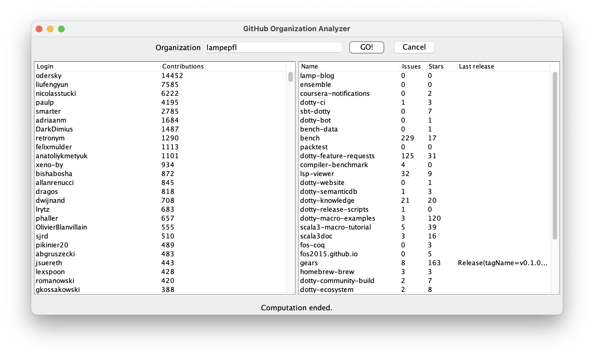

# Analyzer example - monadic `Future` version

To run the example:

```
./gradlew :analyzer-direct:run
```

In order to run the application you need to place inside the `analyzer-commons` directory a `.env` file containing [your personal GitHub access token](https://docs.github.com/en/authentication/keeping-your-account-and-data-secure/managing-your-personal-access-tokens), like:

```env
GH_TOKEN=....
```

or having set an environment variable named `GH_TOKEN`.



Warning: Incremental retrieval of results from the github api using pagination has not been implemented for this version (the data displayed may therefore be partial)

Have a look to [the documentation](https://tassiluca.github.io/direct-style-experiments/docs/03-channels/) for more details.
